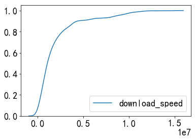

# 仿真是基于相似论的基础


# 仿真可信度的概念

## 1. 可信度和逼真度

仿真总是希望得到的仿真结果与原型系统的输出一致，但由于仿真的不完整性和不确定性，仿真结果和相同输入条件下的仿真对象的响应状态存在一定的差别，即仿真误差。因此，通常用<font color='red' size=3.4>逼真度和可信度</font>来<font color='blue' size=3.4>描述仿真结果的评估状态</font>。


逼真度定义:
    逼真度是仿真对仿真对象某个侧面或者整体的外部状态和行为的复现程度。
    
    1) 逼真度描述仿真对仿真对象的复现程度，而不是仿真对某种特定应用需求的满足程度。
    2) 逼真度考察的是仿真系统或者子系统的外在特性（输入和输出之间关系），而非系统或者子系统本身的实现方式和手段。


可信度定义：
    可信度是由仿真系统与原型系统之间的相似性决定，表征仿真系统与仿真目的的适应的程度。
    
    1) 仿真系统可信度的主体是仿真系统的使用者，反映了仿真系统使用者应用仿真系统的一种相信程度。
    2) 仿真系统的可信度受到仿真系统所处的外界环境因素的限制，反应的是真实世界的一部分的适应程度。
    3）仿真系统的输入是在一定条件下获得的，因此仿真结果的正确性受输入条件的影响。
    4）仿真系统可信度是解决所定义问题的正确性在仿真系统使用者头脑中的反映，问题越明确，仿真系统可信度越高。
    
    
逼真度描述仿真系统与原型系统外在的相似程度，解决仿真"像或不像"的问题；可信度是用来表示仿真与仿真目的的适应程度，反应仿真与仿真对象的差别对仿真可用性的影响程度。

# 仿真可信度评估的意义


仿真的可信度评估伴随着仿真系统的设计,开发,运行,维护的整个生命周期,重大意义在于可以有效地提高仿真系统可信度水平和仿真精度,减少由仿真结果不准确或错误的分析和决策带来的风险. 具体体现在以下几点:

- 仿真可信度评估可以增强应用建模仿真的信心
- 减少建模仿真的风险
- 增强建模仿真在未来的可用性
- 可以节省建模仿真的费用
- 更好地完成系统分析
- 能够适应国际标准发展的要求


# 影响仿真可信度的主要因素

1. 建模过程中忽略了部分次要因素(模型结构的影响)
2. 模型运行过程中模型参数的影响
3. 随机数据的模拟不确定(模型中随机因素的影响)
4. 仿真输出结果的统计误差(可信度评估所用的数据的影响)
5. 评估方法与模型和数据的不适配性(评估方法的影响)
6. 子模型评估的累积误差的影响

# 当前仿真可信度评估的难点

1. 找出合适的模型的可信度评估方法需要丰富的经验和技巧
2. 影响模型可信度的因素繁多而且复杂:(模型的结构-共性,模型的参数,随机因素的模型-体现了模型的个性)
3. 需要大量的测试和计算
4. 系统级,复杂大系统的模型的可信度评估难以实现
5. 原型系统没有输出或者难以采集到数据使得常规的可信度评估方法难以应用(研究小样本甚至零样本情况下的模型的可信度评估方法,是一个迫切且具有挑战性的技术难题)

# 常用的可信度评估方法

## 数理统计法

1. 参数估计法(点估计,区间估计,Bayes估计)
2. 假设检验法(参数假设检验(t检验,F-检验等),非参数假设检验(游程检验,秩和检验等))

## 动态关联法

1. TIC不等式系数法
2. 灰色关联法
3. 回归分析法
4. 系统辨识法


## 谱分析法

1. 瞬时谱法
2. 最大熵谱估计法
3. 最小交叉熵谱估计法
4. 小波分析法

# 网络统计数据集

## M-Lab 数据集(http://www.neubot.org/data)


### overview

M-Lab旨在通过向消费者提供有关互联网性能的有用信息来推进互联网研究。通过提供免费、开放的互联网测量数据，研究人员、监管机构、倡导团体和普通公众可以更好地了解互联网是如何为他们服务的，以及如何为未来维护和改进它。提供一个开放的、可验证的全球网络性能测量平台，托管全球最大的开放互联网性能数据集，创建可视化和工具，帮助人们理解互联网性能。

真正的科学需要可验证的过程，而M-Lab欢迎科学合作和审查。这就是为什么M-Lab s全球测量平台收集的所有数据都是公开的，而M-Lab托管的所有测量工具都是开源的。任何有时间和技能的人都可以回顾和改进M-Lab s平台、工具和数据所依赖的基本方法和假设。透明度和审查是好的科学的关键，好的科学是好的测量的关键。

### 数据分类

M-Lab上的许多实验的测量数据通过ETL管道进行处理，以两种形式发布:谷歌云存储的原始测量的文本数据；谷歌BigQuerry发布数据，为测试子集解析数据，并在BigQuery上发布数据，以便用户可以在数据上运行SQL查询。

#### 主动测量数据

1. MobiPerf：移动平台上用于测量网络性能的开源应用程序。 该应用程序收集的原始数据提供[谷歌云的存储](https://console.cloud.google.com/storage/browser/openmobiledata_public)

2. [Neubot](https://www.measurementlab.net/tests/neubot): 测量互联网数据收集数据用于带宽性能、网络中立性以及网络审查制度的研究。收集的原始数据[谷歌云地址](https://www.measurementlab.net/tests/neubot). 参考论文[Masala E, Servetti A, Basso S, et al. Challenges and issues on collecting and analyzing large volumes of network data measurements[M] New Trends in Databases and Information Systems. Springer, Cham, 2014: 203-212.](https://link.springer.com/chapter/10.1007/978-3-319-01863-8_23)

3. NDT : 网络诊断工具(NDT)测量高负载下TCP连接的特征。 

4. NPAD :　：网络路径和应用程序诊断(NPAD)诊断网络路径中可能降低网络性能的问题．

5. Reverse Traceroute : 测量从选定的网络端点返回到用户的网络路径，并提供关于网络路由和拓扑的丰富信息来源。

6. SideStream: 收集关于系统上已完成的TCP连接的TCP状态信息。

.....

#### 平台测量数据

1. M-Lab Collectd : M-Lab Collectd是M-Lab切片的监控工具，它收集所有M-Lab服务器的资源利用率信息。

2. M-Lab DOISCO Sqitch Telementry Data : 自2016年6月以来，M-Lab为每个M-Lab服务器和站点上行采集高分辨率交换机遥测数据，并将作为DISCO数据集发布。


#### 历史数据集

1. Glasnost ：检测网络流量的优先级或审查。
2. Pathload2 ：测量互联网连接的可用带宽。

### 典型的案例

Neubot 测试数据集：

三种测试类型：

- speedtest：通过发起http请求，测量round-trip time，download speed ，upload speed
- bittorent test：通过发起Bit Torrent 协议请求，测量round-trip time，download speed ，upload speed
- raw test：进行一个原始的持续10S的TCP下载，测试下载速度，并且收集关于TCP 发送端的统计指标。

speedtest收集到的数据记录实例：

- uuid：随机序列号用于标识客户端设备，对时间序列分析有用。
- timestamp：测试执行时候的时间戳，自从1970年1月1号以来的流逝时间。
- real_address：Neubot的ip地址，在服务端看到的ip地址。
- remote_address: 服务端的ip地址。
- connect_time：通过测量连接系统调用完成所需的时间(以秒为单位)来估计RTT。
- download_speed：下载速度（接收到的字节数除以下载时间）Bps。
- upload_speed：上传速度（发送的字节数除以上传时间）Bps。
- latency：通过测量在发送一个小请求和收到一个小的回复的时间的平均值。
- internal_address: 在局域网内部的客服端的ip地址。


数据集分析的维度：


- time：客户机在连接到Internet时定期运行测试。需要考虑测量参数随时间的变化，以便更好地理解连接的情况，并在相同条件下立即将其与其他客户机联系起来。
- location：关于客户的近似物理位置的信息将在理解Internet访问参数中检测到的任何异常值是否是由于位置(例如，在某个区域供应的资源稀缺)或其他(例如，提供者施加的限制)方面发挥作用。这可以通过分析在相同条件下其他客户机的参数行为来检测。
- network metrics：需要分析网络指标本身的值，因为主动测量的信息非常丰富，但是它们可能受到其他基于网络的应用程序的并发使用的影响。
- connectivity type：无线技术在互联网接入方面的广泛使用需要根据连接类型的不同考虑不同的参数，以避免将有线连接的数据与无线连接的数据混合，因为提供这种连接的约束和业务模型有很大的不同。

target：  validate their analytical and simulation models with data from real-world Internet paths。

## CRAWDAD数据集(https://crawdad.org/index.html)

### overview

对无线网络和移动计算的研究得益于对真实网络和真实移动用户数据的访问。从生产无线网络(及其用户)捕获的数据帮助我们理解真实用户、应用程序和设备如何在真实条件下使用真实网络。然而，收集这样的数据既困难又昂贵，因此我们在Dartmouth (CRAWDAD)建立了一个社区资源来归档无线数据，以便在研究社区中共享这些数据集。

CRAWDAD是Dartmouth无线数据归档的社区资源，为研究社区提供无线网络数据资源。该归档具有存储来自许多贡献位置的无线跟踪数据的能力，并且工作人员可以开发更好的工具来收集、匿名化和分析数据。

### 数据分类

提供无线网络相关的测试数据的分享社区，网络涵盖的范围比较宽泛，同时数据的提供，也没有权威的解释，各个数据集的使用的目的和范围非常宽泛。


```python
import os
import sys
import json
import pandas as pd
import numpy as np
from functools import reduce

folder = './neubot/2012/01/30/'
speedIndex = ['real_address', 'privacy_informed', 'privacy_can_publish', 
              'uuid', 'latency', 'neubot_version', 'timestamp',
              'connect_time', 'remote_address', 'platform',
              'upload_speed', 'download_speed', 'internal_address', 'privacy_can_collect']

bittorrentIndex = ['real_address', 'privacy_can_collect', 'privacy_can_publish', 
                   'download_speed', 'neubot_version', 'timestamp', 
                   'connect_time', 'remote_address', 'platform', 
                   'upload_speed', 'internal_address', 'privacy_informed', 'uuid']
def jsonread(file):
    return json.loads(open(file).read())

def funread(xr):
    return jsonread(xr)

def funappend(dt, xr):
    dt.append(xr.values())
    return dt

def phrase(folder):
    speedtestfile = [folder + x for x in os.listdir(folder) if x.endswith('speedtest')]
    bittestfile = [folder + x for x in os.listdir(folder) if x.endswith('bittorrent')]
    
    speedtestdata = reduce(funappend, map(funread, speedtestfile),[])
    bittestdata = reduce(funappend, map(funread, bittestfile),[])
    
    return speedtestdata, bittestdata

sdir , bdir = phrase(folder)

pdspeed = pd.DataFrame(data=sdir, columns=speedIndex)
pdbit = pd.DataFrame(data=bdir, columns=bittorrentIndex)  

import matplotlib.pyplot as plt
from mpl_toolkits.mplot3d import Axes3D
import seaborn as sns

%matplotlib inline

plt.rcParams['font.sans-serif'] = ['KaiTi']
plt.rcParams['font.size'] = 18
plt.rcParams['axes.unicode_minus'] = False
```


```python
sns.kdeplot(pdspeed['latency'],cumulative=True)
```


    <matplotlib.axes._subplots.AxesSubplot at 0x7819160>


```python
sns.kdeplot(pdspeed['latency'],cumulative=False)
```


    <matplotlib.axes._subplots.AxesSubplot at 0x64f8080>


```python
sns.kdeplot(pdspeed['upload_speed'],cumulative=True)
```


    <matplotlib.axes._subplots.AxesSubplot at 0x64f8400>


```python
sns.kdeplot(pdspeed['upload_speed'],cumulative=False)
```


    <matplotlib.axes._subplots.AxesSubplot at 0xa6b9630>


```python
sns.kdeplot(pdspeed['download_speed'],cumulative=True)
```

    F:\ProgramData\Anaconda3\lib\site-packages\scipy\integrate\quadpack.py:364: IntegrationWarning: The integral is probably divergent, or slowly convergent.
      warnings.warn(msg, IntegrationWarning)
    


    <matplotlib.axes._subplots.AxesSubplot at 0xd65f080>


```python
sns.kdeplot(pdspeed['download_speed'],cumulative=False)
```


    <matplotlib.axes._subplots.AxesSubplot at 0xd683eb8>


```python
sns.kdeplot(pdbit['download_speed'],cumulative=True)
```

    F:\ProgramData\Anaconda3\lib\site-packages\scipy\integrate\quadpack.py:364: IntegrationWarning: The integral is probably divergent, or slowly convergent.
      warnings.warn(msg, IntegrationWarning)
    


    <matplotlib.axes._subplots.AxesSubplot at 0xd819dd8>





```python
sns.kdeplot(pdspeed['download_speed'],cumulative=False)
```


    <matplotlib.axes._subplots.AxesSubplot at 0xd8e74a8>


```python
sns.kdeplot(pdbit['upload_speed'],cumulative=True)
```


    <matplotlib.axes._subplots.AxesSubplot at 0xd882390>


```python
sns.kdeplot(pdbit['upload_speed'],cumulative=False)
```


    <matplotlib.axes._subplots.AxesSubplot at 0xd6da550>


```python
sns.kdeplot(pdbit['connect_time'],cumulative=False)
```


    <matplotlib.axes._subplots.AxesSubplot at 0xda65208>


```python
sns.kdeplot(pdbit['connect_time'],cumulative=True)
```


    <matplotlib.axes._subplots.AxesSubplot at 0xdae0358>


# 思路和难点


